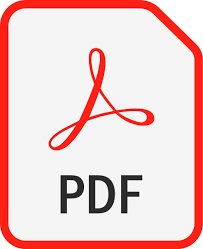

## Research Web3 Engineer at Nokia Bell-Labs.

Research interests are:
1) Distributed Ledger Technologies 
2) Service Level Agreements
3) Accountable and Tansparent Networks
3) Network design for 6G and beyond

## Projects 
---

### PhD Projects
- BEAT: Blockchain-Enabled Accountable and Transparent Network Sharing

- Accountable Quality of Service Monitoring and SLA Management with Just-in-Time Smart Contracts

### MRes Project
Evolution of Metadata in Bitcoin Blockchain

## Invited Talks
---

Smart Contracts Standardisation Workshop -- organised by EU Commission - 07th June 2022 

EUBOF Workshop on Smart Contracts -  organised by EU Blockchain Observatory & Forum - 10th March 2022  <a href="https://youtu.be/relp8dgbzqY"> EUBOF YouTube Link </a>  

IEEE Blockchain Symposium - **IEEE UAE Blockchain Kick-Off Symposium** organised by University of Dubai - 09th March 2022 

ICT Verticals and Horizontals for Blockchain Standardisation - **Round Table on Smart Contracts** organised by European Commission - 21st April 2021 

ICT Verticals and Horizontals for Blockchain Standardisation - **Round Table on IoT organised by European Commission** - 27th January 2021 

EU Cyber Security Week - ETSI - 29th October 2020 

 Joining Forces for Blockchain Standardisation - European Commission - 17th June 2020 

GSMA Operator Platform workshop London - 16th September 2019

Blockchain Technology and Cryptocurrencies and their Future in Pakistan - Bahria University - October 2018

## Education
---
- PhD - King's College London (2018 - 2022)

- Master of Research (Security Science) - University College London (UCL) (2016 - 2017)

- Master of Science (Telecommunication and Networks) - Bahria University, Karachi, Pakistan (2005-2007)

- Bachelor of Computer Engineering - Bahria University, Karachi, Pakistan (2001 - 2005)

## Publications
---

- How to Design Autonomous Service Level Agreements for 6G (***IEEE Communications Magazine*** **Accepted - March 2023**)   
- BEAT: Blockchain-Enable Accountable and Transparent Infrastructure Sharing (***IEEE Access 2022***)   

- BEAT: Blockchain-Enable Accountable and Transparent Network Sharing (***IEEE Communications Magazine 2022***)  

- Automated Quality of Service Monitoring for 5G and Beyond Using Distributed Ledgers (***IWQoS'21***)  
<!-- - [AJIT: Accountable Just-in-Time Network Resource Allocation
with Smart Contracts](/pdf/AJIT.pdf) -->

<!-- - [The Evolution of Embedding Metadata in Blockchain](https://arxiv.org/abs/1806.06738)-->
- How to Request Network Resources Just-in-Time using Smart Contracts (***ICBC'21***)  
  
- AJIT: Accountable Just-in-Time Network Resource Allocation with Smart Contracts (***MobiArch'20***)  

- The Evolution of Embedding Metadata in Blockchain  (***IJCNN'18***)  
<!-- - [AJIT: Accountable Just-in-Time Network Resource Allocation
with Smart Contracts](/pdf/AJIT.pdf) -->

---

## Standards Contribution

- Rapporteur of the Work Item on 'Smart Contracts' **Group Report PDL - 004** ETSI Industries Specifications Group (ISG) for Permissiond Distributed Ledgers (PDL) <a href="https://portal.etsi.org/webapp/WorkProgram/Report_WorkItem.asp?WKI_ID=58907">Link to the WI</a>

- Rapporteur of the Work Item on 'Smart Contracts' **Group Specifications PDL - 11** ETSI Industries Specifications Group (ISG) for Permissiond Distributed Ledgers (PDL) <a href="https://portal.etsi.org/webapp/WorkProgram/Report_WorkItem.asp?WKI_ID=62584">Link to the WI</a>

- Rapporteur of the Work Item on 'Study on Non-Repudiation Techniques' **Group Report PDL - 14** ETSI Industries Specifications Group (ISG) for Permissiond Distributed Ledgers (PDL) <a href="https://portal.etsi.org/webapp/WorkProgram/Report_WorkItem.asp?WKI_ID=64281">Link to the WI</a>

---

Page template forked from <a href="https://github.com/evanca/quick-portfolio">evanca</a>

<!-- Remove above link if you don't want to attibute -->
